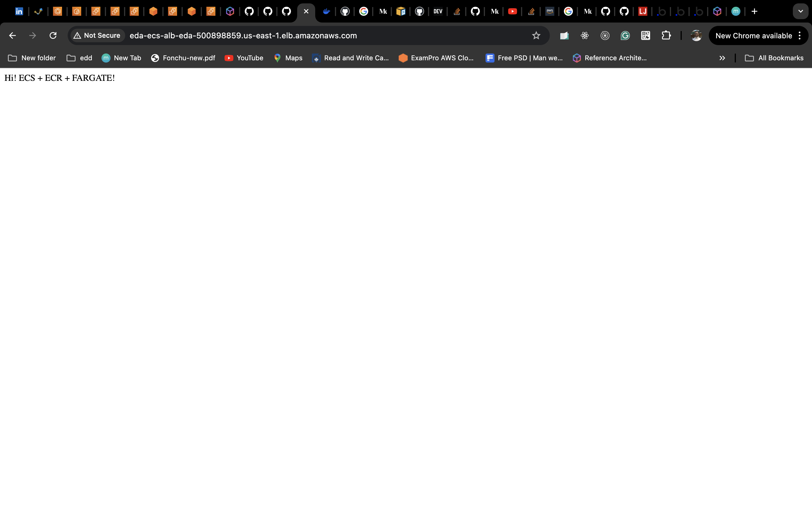

# Integration Process
To integrate CICD (Devops) with AWS CDK in your nodeJs Typescript project, follow the steps below.

### Step One : Clone the repository

` git clone https://github.com/vernyuy/devops-first-app.git`

### Step Two: Install the dependencies

`cd devops-first-app`

`npm install`

### Step Three: Add the following secrets to your git repo

- AWS_ACCOUNT_ID
- AWS_ACCESS_KEY_ID
- AWS_SECRET_ACCESS_KEY
- AWS_REGION
- REPO_NAME                  # Define within the code
- ECS_CLUSTER_NAME           # Define within the code
- ECS_SERVICE_NAME           # Define within the code
- LOAD_BALANCER_NAME         # Define within the code

### Step Four: Bootstrap the cdk application.

` cdk bootstrap`

### Step Five: Run the following command

``` cdk deploy repoStackName ```

Running the above command creates and empty registry in your as account account that can then be referenced by other stacks.

### Step Six: Commit and push to the `infrastructure` branch of your github repo

Note that pushing to branch `infrastructure` will deploy your infrastructure.

### step Seven: Test by getting the DNS after github actions are done running



### Step Eight: Modify

Now you can start making changes to your nodejs app and pushing to the `code` branch which will build a docker image and push the `Aws ecr` authomatically on every git commit.

Thank you.