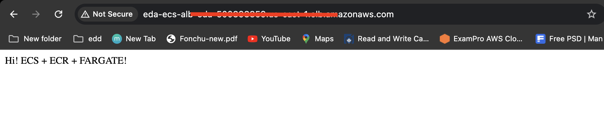

# Integration Process
To integrate CICD (Devops) with AWS CDK in your nodeJs Typescript project, follow the steps below.

Step One : Clone the repository

` git clone https://github.com/vernyuy/devops-first-app.git`

Step Two: Install the dependencies

`cd devops-first-app`

`npm install`

Step Three: Add the following secrets to your git repo

- AWS_ACCOUNT_ID
- AWS_ACCESS_KEY_ID
- AWS_SECRET_ACCESS_KEY
- AWS_REGION
- REPO_NAME                  # Define within the code
- ECS_CLUSTER_NAME           # Define within the code
- ECS_SERVICE_NAME           # Define within the code
- LOAD_BALANCER_NAME         # Define within the code

Step Four: Bootstrap the cdk application.
` cdk bootstrap`

Step Five: Run the following command
``` cdk deploy repoStackName ```

Running the above command creates and empty registry in your as account account that can then be referenced by other stacks.

Step Six: Commit and push to the `infrastructure` branch of your github repo
Note that pushing to branch `infrastructure` will deploy your infrastructure.

step Seven: Test by getting the DNS after github actions are done running


Step Eight: Now you can start making changes to your nodejs app and pushing to the `code` branch which will build a docker image and push the `Aws ecr` authomatically on every git commit.


### Get Started

- **Initialize a new AWS CDK application**

The new project file structure should  e similar to the one below

```
my-cdk-ts-project
├── bin
│   └── my-cdk-ts-project.ts
├── lib
│   └── my-cdk-ts-project-stack.ts
├── node_modules
├── test
│   └── my-cdk-ts-project.test.ts
├── cdk.json
├── jest.config.js
├── .git
├── .gitignore
├── .npmignore
├── README.md
├── package-lock.json
├── package.json
└── tsconfig.json

```

- **Move Your `node js` application to the root directory of the cdk application**

```
my-cdk-ts-project
├── bin
│   └── my-cdk-ts-project.ts
├── lib
│   └── my-cdk-ts-project-stack.ts
├── nodejs-application
│   ├── src
│   │   └── index.ts
│   ├── Dockerfile
│   ├── node_modules
│   ├── package-lock.json
│   ├── package.json
│   └── tsconfig.json
├── node_modules
├── test
│   └── my-cdk-ts-project.test.ts
├── cdk.json
├── jest.config.js
├── .git
├── .gitignore
├── .npmignore
├── README.md
├── package-lock.json
├── package.json
└── tsconfig.json

```


- **Add the github workflow files**
    - Workflow to deploy the infrastructure
        - At the root directory of your project, create a folder with name `.github`. 
        - Within the `.github` folder, create another folder with name `workflows`.
        - Create a file with name `infrastructure-cicd-workflow.yml` and add the following code

```yaml
name: AWS Service CI/CD
on:
  push:
    branches: 
      - main

jobs:
  build:
    runs-on: ubuntu-latest
    steps:
      - run: echo "🎉 The job was automatically triggered by a ${{ github.event_name }} event."
      - run: echo "🐧 This job is now running on a ${{ runner.os }} server hosted by GitHub!"
      - run: echo "🔎 The name of your branch is ${{ github.ref }} and your repository is ${{ github.repository }}."
      - run: echo "💡 The ${{ github.repository }} repository has been cloned to the runner."
      - uses: actions/checkout@v3
      - name: Set up Node
        uses: actions/setup-node@v3
        with:
          node-version: "20"
      - name: Install the CDK Dependency
        run: |
          npm install -g aws-cdk
      - name: Install other dependencies
        run: |
          npm install
      - name: Configure AWS credentials
        uses: aws-actions/configure-aws-credentials@master
        with:
          aws-access-key-id: ${{ secrets.AWS_ACCESS_KEY_ID }}
          aws-secret-access-key: ${{ secrets.AWS_SECRET_ACCESS_KEY }}
          aws-region: "us-east-1"
      - name: Deploy to AWS
        run: cdk deploy CdkHelloWorldStack
      
      - name: Retrieve ALB DNS name
        run: |
          alb_name="eda-ecs-alb-eda"
          alb_dns=$(aws elbv2 describe-load-balancers --names $alb_name --query "LoadBalancers[0].DNSName" --output text)
          echo "ALB DNS: $alb_dns"
          echo "::set-output name=alb_dns::$alb_dns"

      # - name: Destroy the cdk application
      #   run: cdk destroy --all
```


- 
